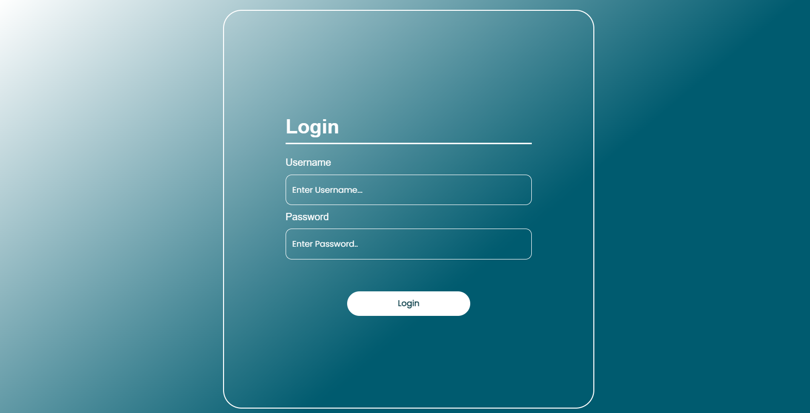
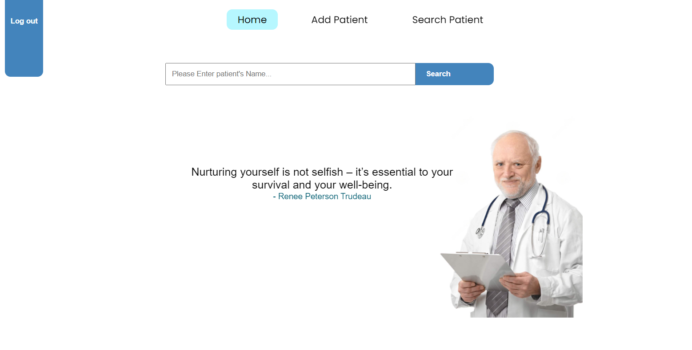
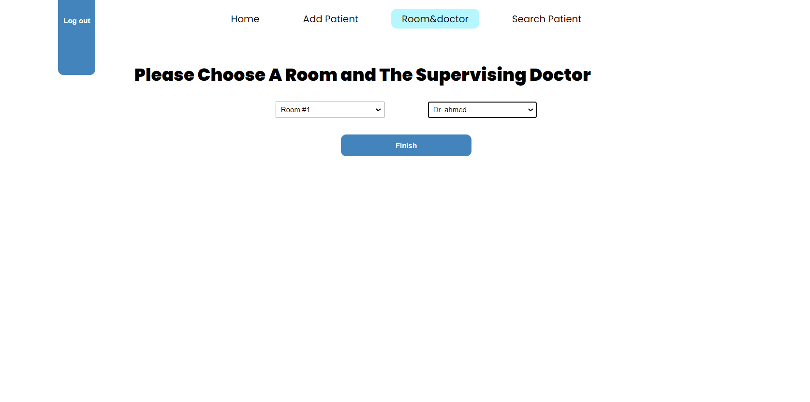
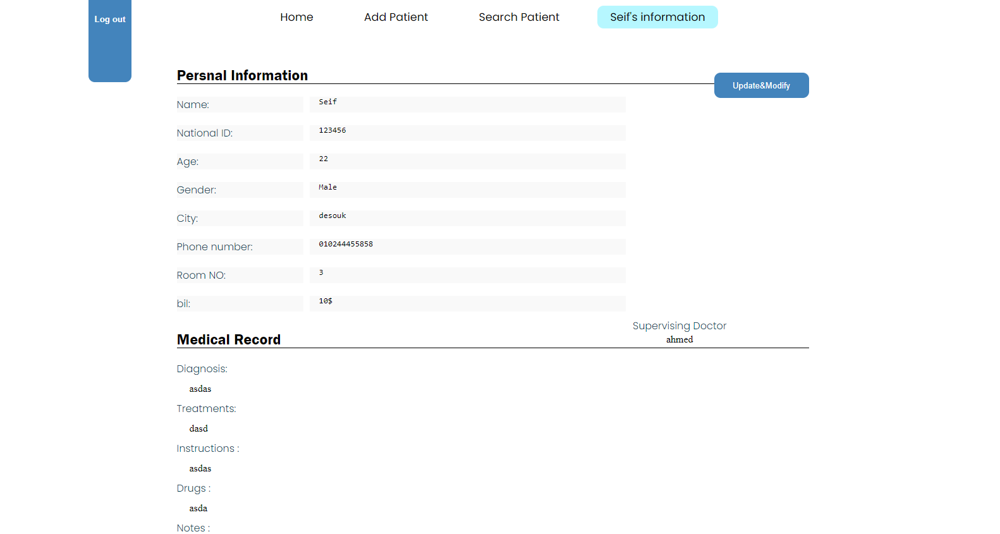
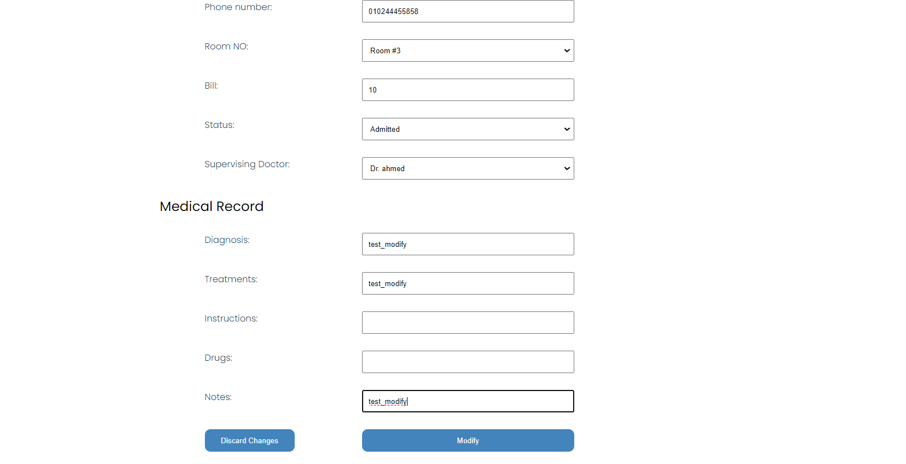

# Hospital Reception System
## Project Overview
web-based hospital reception system designed to facilitate the workflow for receptionists. The system enables receptionists to efficiently manage patient information, search for patients, process patient check-ins, and track all patient interactions.

## Technologies Used
 

 

## Features
- Admit new patients
- Assign a room & a doctor to a patient
- Update Patient's information
- Search for a Patient by **Patient's Name**, **Room Number**, **National ID**, **Patient ID**.
## UI Screenshots

| Screenshot                | Description                |
|---------------------------|----------------------------|
|                   | Login Page|
|                |  Home Page|
|     | Add Patient Page step 1|
|     | Add Patient Page step 2|
|     | Add Patient Page step 3|
|     | Patient Information Page|
|                 | Search Page|
| | Search by Name Page|
|       |  Modify Page|

## Getting Started
### Dependencies
Make sure you have `PHP` 8.1 or higher installed on your machine.

1. Clone the repository 
```shell
git clone https://github.com/Sapagh21/Pharmacy-Management-system.git
 ``` 
2. Navigate to the project's directory
```shell
cd .\Pharmacy-Management-system\
```