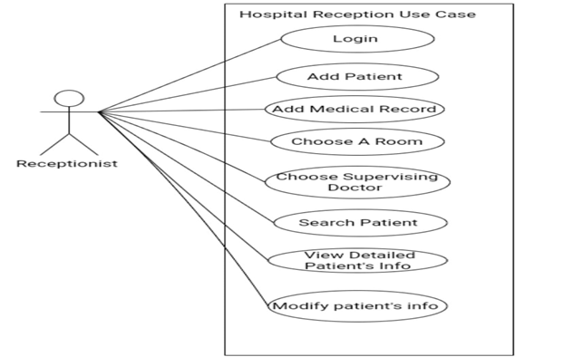
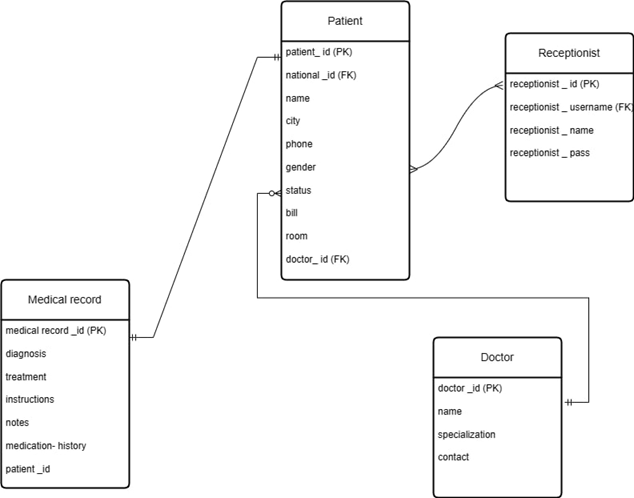
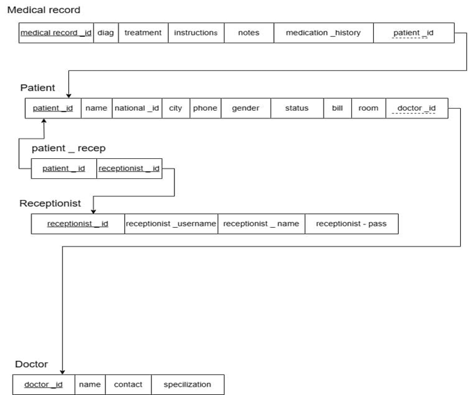

# Hospital Reception System
## Project Overview
web-based hospital reception system designed to facilitate the workflow for receptionists. The system enables receptionists to efficiently manage patient information, search for patients, process patient check-ins, and track all patient interactions.

## Technologies Used
 

 

## Features
### Patient Management
- Add a new patient
- Remove a patient
- Update patient information
- View detailed patient page
- Search for a patient

### Medical Record Management
- Write medical records
- Update medical records
- View detailed medical records

### Room and Doctor Assignment
- Assign a room to a patient
- Assign a supervising doctor

### Search and Track
- Search for patients by ID, name, national ID, or room number


## System Design
| | |
|---|---|
|Use Case Diagram|    |
|Enitiy Relation Diagram (ERD)|    |
|ERD mapping |    |
## UI Screenshots

| Screenshot                | Description                |
|---------------------------|----------------------------|
|                   | Login Page|
|                |  Home Page|
|     | Add Patient Page step 1|
|     | Add Patient Page step 2|
|     | Add Patient Page step 3|
|     | Patient Information Page|
|                 | Search Page|
| | Search by Name Page|
|       |  Modify Page|

## Getting Started
### Dependencies
Make sure you have `PHP` 8.1 or higher and XAMPP installed on your machine.

1. Clone the repository 
```shell
git clone https://github.com/Sapagh21/Hospital-Receptionist.git
 ``` 
2. Navigate to the project's directory
```shell
cd .\Hospital-Receptionist\
```
3. go to `php my admin` 
4. Create a database `hospital`
5. import the database<br>
*You can find the project's database in `db/hospital.sql`*


## [Demo Video](https://drive.google.com/file/d/1969O045KKaAkSYlbFNgAIsbZl5XFJcrK/view?usp=sharing)

